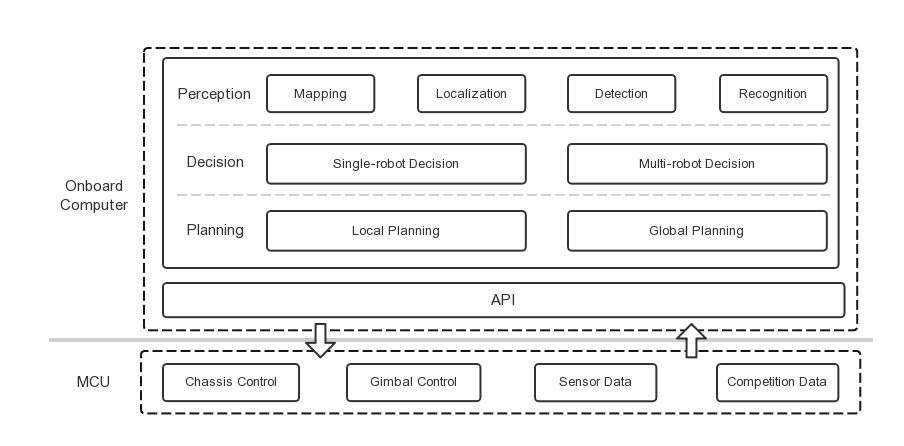

# 软件框架
整个软件系统解耦了驱动模块，功能模块和算法模块，以增强平台的可移植性，提高不同领域开发者合作开发的效率。

整个软件系统架构如下图所示

开发者基于该平台可以自底向上进行编程开发，来控制机器人完成不同的任务，整个框架分为两个部分

作为底层计算平台，STM32微控制器以有限的计算能力运行RTOS（实时操作系统）完成实时各种任务：

- 以编码器或IMU为反馈的闭环控制任务

- 传感器信息的采集、预处理与转发，用于姿态估计

- 转发与比赛相关的信息，例如机器人血量等

机载运算设备（例如Manifold 2）扮演着上层计算平台的角色，负责较大运算量的各种算法执行：

- 环境感知，包括实时定位、建图、目标检测、识别和追踪

- 运动规划，包括全局规划（路径规划），局部规划（轨迹规划）

- 基于观察-动作的决策模型接口，适配各种不同的决策框架，例如FSM（有限状态机），Behavior Tree（行为树）以及其他基于学习的决策框架。

两个运算平台之间通过串口以规定的开源协议进行通信，平台同时提供了基于ROS的API接口，可以在ROS中利用C++或Python编程，进行二次开发。基于这个接口，开发者可以控制机器人底盘和云台的运动，控制发射机构以输入的频率、射速与数量发射弹丸，同时实时接收传感器信息与比赛数据等功能。更高级的应用中，开发者可以根据[roborts_base](sdk_docs/roborts_base)相关文档定义自己的协议，以扩展机器人的功能。

# 应用

RoboRTS及RoboMaster移动机器人平台的初衷，是为了鼓励更多的开发者参与到不同场景与规则下的机器人智能决策研究中来，第一步是基于这个硬件平台实现一些机器人感知或规划算法，以便抽象观察空间与动作空间，更好的构建决策模型。

我们的首要场景是机器人竞技的决策，如下图所示：

追击与搜索：

巡逻：

